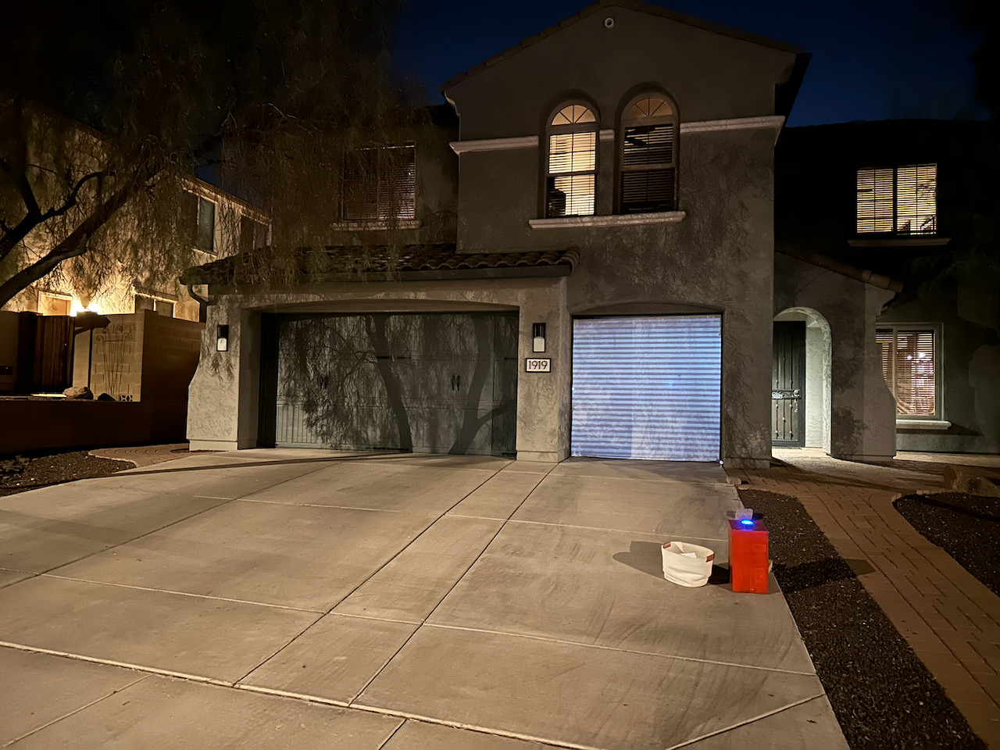
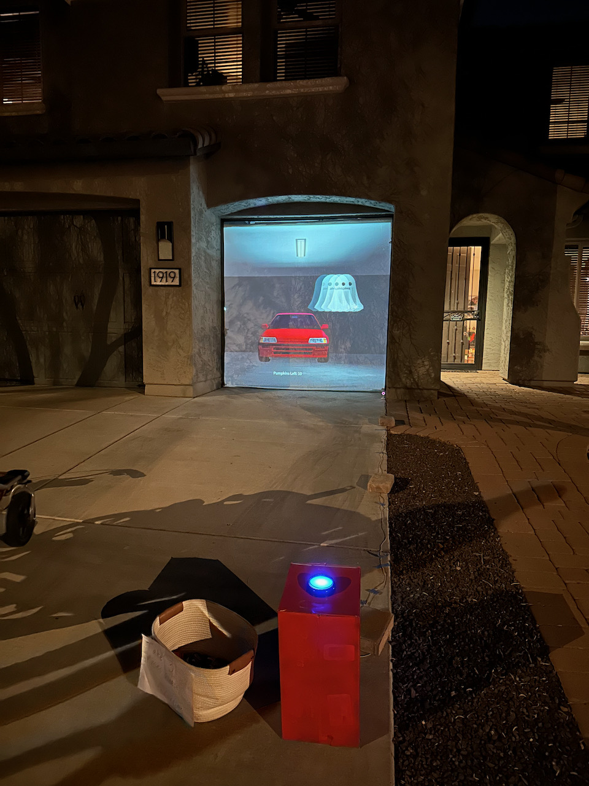
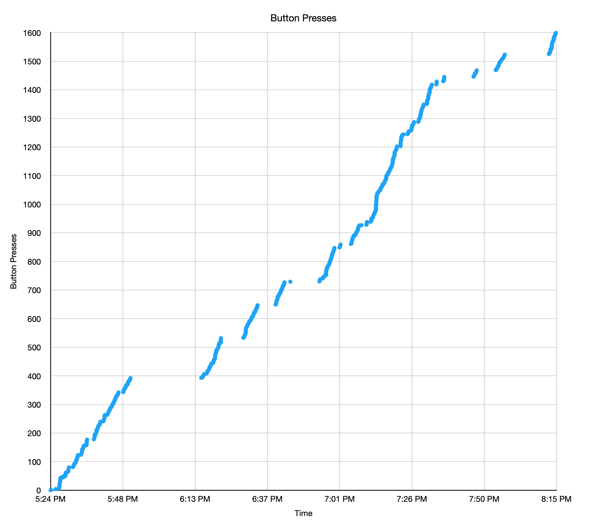

# Halloween Garage Game

A simple but fun one-button game for Halloween.

It simulates a garage door that can open, and when open there is a ghost you can throw pumpkins at. If you do miss the ghost, then you hit the car instead (which honks). You're scored on how many times out of 10 you can hit the ghost. Once you have thrown 10 pumpkins, the garage door will close and the score will be displayed.

docs/img/demo.mov

## Structure

- An arduino sending serial commands when a big blue "arcade" button is pressed
- A nodejs program turning the serial command into key presses
- A Roblox experience, with a fixed camera + game logic. 
- A white sheet hung across an open garage door opening
- Projector projecting from the rear

## Log

### Oct 31, 2023

The only metric captured was button presses. 

